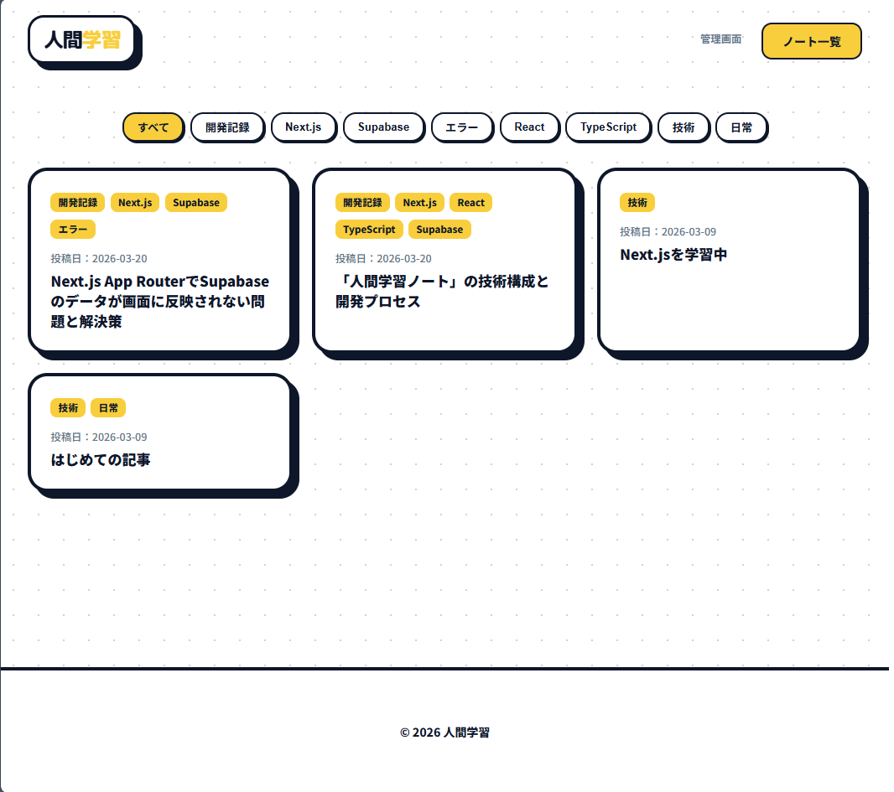

# 人間学習 - ノート

プログラミングとWeb開発の実践記録を投稿・管理するための個人ブログCMS。

## **開発背景**

自身のスキルアップを目的にWeb開発技術の理解を深めるため、自分用のブログシステムを開発しました。
これまで自身のサイト（ningengakushu.com）の「学習ノート」セクションを静的なページとして公開していましたが、それをReact、Next.js、TypeScriptを用いた動的なシステムとして一から作り直すことに挑戦しました。
現在通っている職業訓練で一度は学習したものの、まだ理解が浅かった技術に改めて向き合い、実際の運用を想定しながら最後まで実装しきることを目標に取り組みました。

## **公開URL**

[https://note.ningengakushu.com/](https://note.ningengakushu.com/)

## 主な機能

### 公開ページ
- 記事一覧（タグによるフィルタリング）
- 記事詳細（Markdownレンダリング）

### 管理画面

- ログイン認証
- 記事の作成・編集・削除
- 下書き / 公開 管理
- タグ管理

## 使用技術

| カテゴリ | 技術 | バージョン |
| --- | --- | --- |
| フレームワーク | Next.js (App Router) | 16.1.6 |
| 言語 | TypeScript | 5 |
| UIライブラリ | React | 19.2.3 |
| スタイリング | カスタムCSS | - |
| データベース | Supabase (PostgreSQL) | - |
| ORM | Prisma | 7.4.2 |
| 認証 | Supabase Auth (@supabase/ssr) | 0.9.0 |
| Markdown | react-markdown | 10.1.0 |
| デプロイ | Vercel | - |

## **今後の実装予定**

- 記事ごとのメタデータ: 各記事ページに固有のtitle/descriptionを動的に設定。
- 画像アップロード機能
- 更新日時の追加
- プレビュー機能の実装: 現状の管理画面にはプレビューがありません。
- 全文検索機能: タグだけでなく、キーワードで記事を探せるように。

