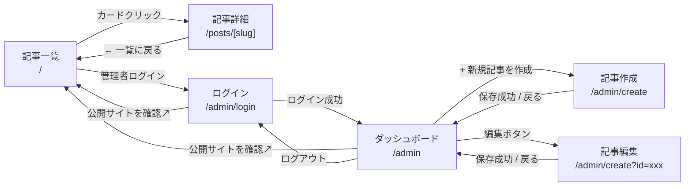
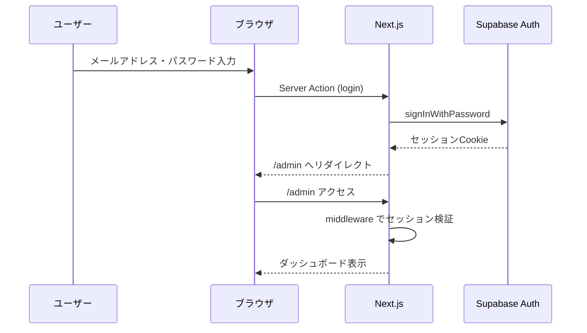

# 基本設計書

## 1. システム概要

個人用ブログ兼コンテンツ管理システム（CMS）。
マークダウンで記事を執筆・管理し、公開サイトで表示する。

- **フロントエンド**: Next.js (App Router), TypeScript
- **データベース**: Supabase (PostgreSQL)
- **ORM**: Prisma
- **認証**: Supabase Auth（メールアドレス＋パスワード）
- **アクセス制御**: Row Level Security (RLS)

---

## 2. データベース設計

### 2.1 テーブル定義

#### `posts` テーブル

| カラム名 | 型 | 制約 | 説明 |
|---|---|---|---|
| `id` | `UUID` | PK, DEFAULT `gen_random_uuid()` | 記事の一意識別子 |
| `title` | `VARCHAR(255)` | NOT NULL | 記事タイトル |
| `slug` | `VARCHAR(255)` | NOT NULL, UNIQUE | URL用スラグ（半角英数字・ハイフン） |
| `content` | `TEXT` | NOT NULL, DEFAULT `''` | Markdown本文 |
| `status` | `VARCHAR(10)` | NOT NULL, DEFAULT `'draft'` | ステータス（`draft` / `published`） |
| `tags` | `TEXT[]` | DEFAULT `'{}'` | タグ（PostgreSQL配列型） |
| `published_at` | `TIMESTAMPTZ` | NULL許容 | 投稿日時（未指定時は初回公開時に自動設定） |
| `created_at` | `TIMESTAMPTZ` | NOT NULL, DEFAULT `now()` | レコード作成日時 |

#### インデックス

| インデックス名 | 対象カラム | 用途 |
|---|---|---|
| `idx_posts_slug` | `slug` | スラグによる記事取得の高速化 |
| `idx_posts_status` | `status` | ステータスによるフィルタリング |
| `idx_posts_published_at` | `published_at` | 投稿日時順ソート |

### 2.2 RLS ポリシー

| ポリシー名 | 対象操作 | 条件 | 説明 |
|---|---|---|---|
| `public_read_published` | `SELECT` | `status = 'published'` | 公開記事は誰でも読み取り可能 |
| `admin_all` | `ALL` | `auth.uid() IS NOT NULL` | 認証済みユーザーは全操作を許可 |

---

## 3. 画面設計

### 3.1 画面一覧

| No. | 画面名 | URL パス | 認証 | 説明 |
|---|---|---|---|---|
| 1 | 記事一覧 | `/` | 不要 | 公開記事の一覧表示・タグフィルター |
| 2 | 記事詳細 | `/posts/[slug]` | 不要 | 公開記事の本文表示 |
| 3 | ログイン | `/admin/login` | 不要 | 管理者ログインフォーム |
| 4 | ダッシュボード | `/admin` | 必要 | 全記事のリスト・管理操作 |
| 5 | 記事作成 | `/admin/create` | 必要 | 新規記事の作成フォーム |
| 6 | 記事編集 | `/admin/create?id=[id]` | 必要 | 既存記事の編集フォーム（作成と同一画面） |

### 3.2 共通レイアウト

#### 公開画面レイアウト

```
┌─────────────────────────────────────┐
│ タイトル                     ログイン │
├─────────────────────────────────────┤
│                                     │
│         （メインコンテンツ）          │
│                                     │
├─────────────────────────────────────┤
│     © 2026 NINGEN GAKUSHU NOTE.     │
└─────────────────────────────────────┘
```

- **ヘッダー**: サイトタイトル（左寄せ）、「管理者ログイン」リンク（右寄せ、`/admin/login` へ遷移）
- **フッター**: コピーライト（中央寄せ）

#### 管理画面レイアウト（ログイン画面含む全管理画面で共通）

```
┌─────────────────────────────────────┐
│ タイトル          公開サイト ログアウト│
├─────────────────────────────────────┤
│                                     │
│          （メインコンテンツ）         │
│                                     │
├─────────────────────────────────────┤
│     © 2026 NINGEN GAKUSHU NOTE.     │
└─────────────────────────────────────┘
```

- **ヘッダー**: サイトタイトル（左寄せ）
- **ナビバー右上**: 「公開サイトを確認」リンク（`/` を新しいタブで開く）、「ログアウト」リンク
  - ※ログイン画面では「公開サイトを確認」のみ表示（「ログアウト」は非表示）
- **フッター**: コピーライト（中央寄せ）

### 3.3 各画面詳細

#### 画面1: 記事一覧（`/`）

**表示要素:**

1. **見出し**: 「記事一覧」
2. **タグフィルターボタン群**:
   - 先頭に「すべて」ボタン（初期状態で選択済み）
   - 以降は公開記事に紐づくタグから動的に生成（例: 技術, デザイン, 日常）
   - 選択中のボタンは塗りつぶしスタイル（紺色背景・白文字）、非選択は枠線スタイル
3. **記事カード一覧**: 各カードに以下を表示
   - タグ（バッジ表示、紺色背景・白文字）
   - 投稿日（ラベル「投稿日:」+ 日付、`YYYY-MM-DD` 形式）
   - タイトル（太字・大きめのフォントサイズ）
   - カード全体がクリック可能（記事詳細へ遷移）

**動作仕様:**
- 初期表示: 全公開記事を投稿日の降順で表示
- タグフィルター押下: 対応するタグの記事のみ表示（クライアントサイド or サーバーサイドフィルター）
- 「すべて」ボタン押下: フィルター解除し全記事表示

---

#### 画面2: 記事詳細（`/posts/[slug]`）

**表示要素:**

1. **戻るリンク**: 「← 一覧に戻る」（`/` へ遷移）
2. **メタデータ領域**:
   - タグ（バッジ表示）
   - 投稿日（ラベル「投稿日:」+ 日付）
3. **タイトル**: `<h1>` で表示
4. **本文**: Markdown → HTML レンダリング結果を表示

**動作仕様:**
- `[slug]` パラメータで記事を取得（`status = 'published'` の記事のみ）
- 該当記事が存在しない場合は 404 ページを表示

---

#### 画面3: ログイン（`/admin/login`）

**表示要素:**

1. **見出し**: 「ログイン」（中央寄せ）
2. **説明文**: 「管理者用ページです。」
3. **ログインフォーム**:
   - メールアドレス入力欄（ラベル「メールアドレス:」、`type="email"`）
   - パスワード入力欄（ラベル「パスワード:」、`type="password"`）
   - 「ログイン」ボタン（フォーム幅いっぱい）

**動作仕様:**
- Supabase Auth の `signInWithPassword` でログイン処理
- ログイン成功時: `/admin` へリダイレクト
- ログイン失敗時: エラーメッセージを表示（例:「メールアドレスまたはパスワードが正しくありません」）
- 既にログイン済みの場合: `/admin` へリダイレクト

---

#### 画面4: ダッシュボード（`/admin`）

**表示要素:**

1. **見出し**: 「記事一覧」
2. **新規作成リンク**: 「+ 新規記事を作成」（`/admin/create` へ遷移）
3. **記事テーブル**:

| カラム | 表示内容 |
|---|---|
| タイトル | 記事タイトル（テキスト表示） |
| タグ | タグ名（カンマ区切りテキスト） |
| 投稿日 | `YYYY-MM-DD` 形式 |
| ステータス | 「公開中」/「下書き」 |
| 操作 | 「編集」ボタン、「削除」ボタン |

**動作仕様:**
- 全記事を取得して表示（ステータスに関わらず全件）
- 「編集」ボタン押下: `/admin/create?id=[id]` へ遷移
- 「削除」ボタン押下: 確認ダイアログ「本当に削除しますか？」を表示 → OK で削除実行 → 一覧を再取得

**認証ガード:**
- 未ログイン時は `/admin/login` へリダイレクト

---

#### 画面5・6: 記事作成・編集（`/admin/create` / `/admin/create?id=[id]`）

**表示要素:**

1. **見出し**: 「記事の作成 / 編集」
2. **入力フォーム**:

| 項目 | HTML要素 | 説明 |
|---|---|---|
| タイトル | `<input type="text">` | 必須入力 |
| スラッグ (URL文字列) | `<input type="text">` placeholder=`"example-post"` | 必須入力 |
| 投稿日 | `<input type="datetime-local">` | 任意。未指定時は自動設定。補足「※未指定時は自動設定」を表示 |
| タグ | `<input type="text">` placeholder=`"例: 技術, 日常"` | カンマ区切りで複数指定 |
| 本文 (Markdown) | `<textarea>` | Markdown 記法で入力 |
| ステータス | `<input type="radio">` × 2 | 「下書き」（初期値） / 「公開」 |

3. **アクションボタン**:
   - 「保存する」ボタン（フォーム送信）
   - 「戻る」リンク（`/admin` へ遷移）

**動作仕様（新規作成: クエリパラメータ `id` なし）:**
- フォームは空の初期状態で表示
- ステータスのデフォルトは「下書き」
- 「保存する」押下時:
  - バリデーション（タイトル・スラッグは必須）
  - `published_at` 未指定の場合、現在日時を自動設定
  - Supabase にレコードを INSERT
  - 保存成功: アラートダイアログで完了通知後、`/admin` へリダイレクト
  - 保存失敗: エラーメッセージを表示

**動作仕様（編集: クエリパラメータ `id` あり）:**
- `id` で記事を取得し、各フィールドに既存データをセット
- 「保存する」押下時:
  - バリデーション（タイトル・スラッグは必須）
  - Supabase のレコードを UPDATE
  - 保存成功: アラートダイアログで完了通知後、`/admin` へリダイレクト
  - 保存失敗: エラーメッセージを表示

**認証ガード:**
- 未ログイン時は `/admin/login` へリダイレクト

---

## 4. 画面遷移図



---

## 5. API 設計（Server Actions / Route Handlers）

### 5.1 公開系 API

| 用途 | 方式 | パス / 関数名 | 入力 | 出力 |
|---|---|---|---|---|
| 公開記事一覧取得 | Server Component | `app/page.tsx` 内で直接取得 | なし | `Post[]`（`status='published'`、`published_at` 降順） |
| 公開記事詳細取得 | Server Component | `app/posts/[slug]/page.tsx` 内で直接取得 | `slug: string` | `Post \| null` |

### 5.2 管理系 API（Server Actions）

| 用途 | 関数名 | 入力 | 出力 | 備考 |
|---|---|---|---|---|
| ログイン | `login` | `email`, `password` | 成功: リダイレクト / 失敗: エラー | Supabase Auth |
| ログアウト | `logout` | なし | アラート（「ログアウトしました」）表示後リダイレクト | Supabase Auth |
| 全記事取得 | `getAllPosts` | なし | `Post[]` | ステータス問わず全件 |
| 記事取得（ID） | `getPostById` | `id: string` | `Post \| null` | 編集画面用 |
| 記事作成 | `createPost` | `PostInput` | `Post` | INSERT |
| 記事更新 | `updatePost` | `id: string`, `PostInput` | `Post` | UPDATE |
| 記事削除 | `deletePost` | `id: string` | `void` | DELETE |

### 5.3 型定義

```typescript
// 記事の型
type Post = {
  id: string;
  title: string;
  slug: string;
  content: string;
  status: 'draft' | 'published';
  tags: string[];
  published_at: string | null;
  created_at: string;
};

// 記事入力の型（作成・更新用）
type PostInput = {
  title: string;
  slug: string;
  content: string;
  status: 'draft' | 'published';
  tags: string[];
  published_at?: string | null;
};
```

---

## 6. ディレクトリ構成

```
ningen_note/
├── app/
│   ├── layout.tsx              # 公開画面の共通レイアウト（ヘッダー・フッター）
│   ├── page.tsx                # 記事一覧ページ
│   ├── posts/
│   │   └── [slug]/
│   │       └── page.tsx        # 記事詳細ページ
│   └── admin/
│       ├── layout.tsx          # 管理画面の共通レイアウト（ナビバー・認証ガード）
│       ├── login/
│       │   └── page.tsx        # ログインページ
│       ├── page.tsx            # ダッシュボードページ
│       └── create/
│           └── page.tsx        # 記事作成・編集ページ
├── components/
│   ├── Header.tsx              # 公開画面ヘッダー
│   ├── Footer.tsx              # 公開画面フッター
│   ├── ArticleCard.tsx         # 記事カードコンポーネント
│   ├── TagFilter.tsx           # タグフィルターコンポーネント
│   └── AdminNav.tsx            # 管理画面ナビバー
├── lib/
│   ├── supabase/
│   │   ├── client.ts           # Supabase クライアント初期化（ブラウザ用）
│   │   └── server.ts           # Supabase クライアント初期化（サーバー用）
│   ├── prisma.ts               # Prisma クライアント初期化
│   └── actions.ts              # Server Actions（CRUD操作）
├── prisma/
│   └── schema.prisma           # Prisma スキーマ定義
└── middleware.ts               # 認証ミドルウェア（管理画面の認証ガード）
```

---

## 7. 認証・セキュリティ設計

### 7.1 認証フロー



### 7.2 認証ガード

- **`middleware.ts`** で `/admin` 以下（`/admin/login` を除く）へのアクセス時にセッションを検証
- セッションが無効な場合は `/admin/login` へリダイレクト
- セッション情報は Cookie で管理（Supabase の `@supabase/ssr` パッケージを使用）

### 7.3 RLS（Row Level Security）

- Supabase 側で `posts` テーブルに RLS を有効化
- 公開画面からは `status = 'published'` のレコードのみ `SELECT` 可能
- 認証済みユーザーは全操作（`SELECT`, `INSERT`, `UPDATE`, `DELETE`）を許可

---

## 8. エラーハンドリング方針

| 画面 | エラー種別 | 対応 |
|---|---|---|
| ログイン | 認証失敗 | フォーム上部にエラーメッセージ表示 |
| 記事詳細 | 記事未存在 | Next.js の `notFound()` で 404 ページ表示 |
| 記事作成・編集 | バリデーションエラー | 該当フィールド付近にエラーメッセージ表示 |
| 記事作成・編集 | 保存失敗 | フォーム上部にエラーメッセージ表示 |
| 記事削除 | 削除失敗 | アラートでエラーメッセージ表示 |
| 管理画面全般 | 未認証アクセス | `/admin/login` へリダイレクト |

---

## 9. 表示ルール・ビジネスロジック

### 9.1 日時の表示

- 表示フォーマット: `YYYY-MM-DD`（例: 2026-03-08）
- タイムゾーン: JST（Asia/Tokyo）で表示

### 9.2 タグフィルター

- 公開記事に紐づくタグを重複排除して動的にボタン生成
- 先頭に「すべて」ボタンを固定配置
- フィルター選択は排他的（1つのタグのみ選択可能）

### 9.3 ステータス管理

| ステータス値 | 表示ラベル（管理画面） | 公開画面での表示 |
|---|---|---|
| `draft` | 下書き | 非表示 |
| `published` | 公開中 | 表示 |

### 9.4 スラッグのルール

- 半角英数字とハイフンのみ使用可能
- 全記事でユニーク
- 公開画面の記事詳細 URL に使用（`/posts/[slug]`）
